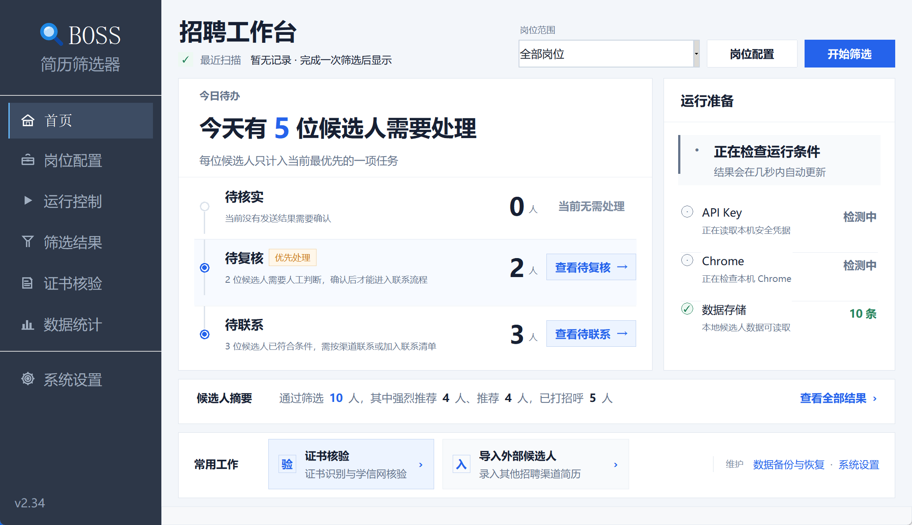
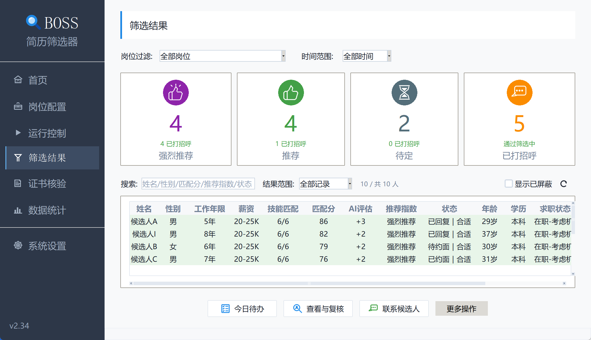
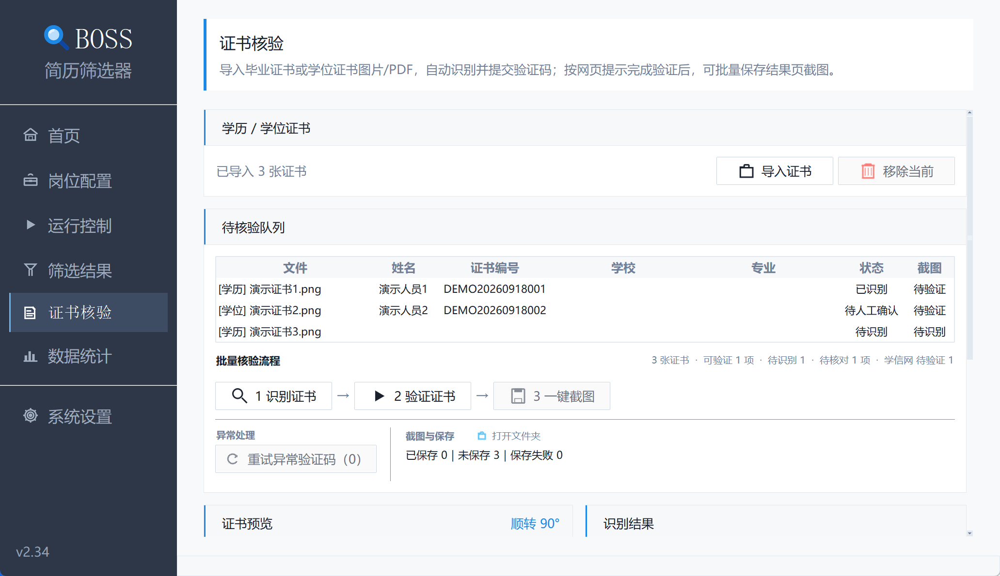

<h1 align="center">BOSS 简历筛选器</h1>

<p align="center">
  面向招聘团队的本地桌面工作台：从候选人获取和简历导入，到规则 / AI 评估、人工复核、联系跟进与数据复盘，在一个流程中完成。
</p>

<p align="center">
  <a href="https://github.com/yaoyouzhong/boss-resume-filter/releases/latest"></a>
  <a href="https://github.com/yaoyouzhong/boss-resume-filter/actions/workflows/pr-checks.yml"></a>
  
</p>

<p align="center">
  <strong><a href="https://github.com/yaoyouzhong/boss-resume-filter/releases/latest/download/BOSS_ResumeFilter.exe">Windows 下载</a></strong>
  · <strong><a href="https://github.com/yaoyouzhong/boss-resume-filter/releases/latest/download/BOSS_ResumeFilter.dmg">macOS 下载</a></strong>
  · <a href="https://gitee.com/yaoyouzhong/boss-resume-filter/releases">国内镜像</a>
  · <a href="GUI%20使用说明.md">图文使用手册</a>
  · <a href="CHANGELOG.md">更新记录</a>
</p>

> 当前发布版本：v2.31 学历核验与批量结果截图（版本号 v2.31）



> **使用边界**：本项目不是 BOSS 直聘官方工具。浏览器自动化、候选人信息读取和联系功能可能触发平台风控、限流或账号限制；使用前请阅读完整的 [使用声明](DISCLAIMER.md)。

## 一个完整的招聘处理流程

| 1. 配置岗位 | 2. 获取候选人 | 3. 筛选评估 | 4. 复核联系 | 5. 跟进复盘 |
|---|---|---|---|---|
| 解析招聘需求，检查条件冲突与遗漏 | 获取 BOSS 推荐候选人，或导入猎头、内推等外部简历 | 根据硬条件和技能权重评分，可选 AI 辅助评估 | 人工处理待复核候选人，确认联系清单和发送结果 | 维护回复、约面与下次跟进，查看岗位效果和统计 |

候选人只进入当前最高优先级的一项待办，筛选结论、复核状态和沟通状态分开记录。规则或 AI 证据不足时转人工确认，不用模糊结果替代招聘判断。

## 核心能力

| 能力 | 说明 |
|---|---|
| **候选人获取与导入** | 自动滚动获取 BOSS 推荐候选人；支持批量导入 PDF、DOCX、旧版 DOC、TXT、MD、RTF 和 HTML 简历 |
| **可解释筛选** | 综合经验、学历、年龄、性别、薪资、地点、必要条件和技能权重评分，保留分数拆解与关键词证据 |
| **AI 辅助判断** | 可选增强岗位解析、候选人画像和简历评估；AI 只提供辅助证据，冲突或信息不足时进入人工复核 |
| **复核与联系工作台** | 连续处理待复核候选人，发送前确认联系清单；支持暂停、失败重试和发送结果人工核实 |
| **待办、跟进与复盘** | 统一管理待核实、待复核、待联系和到期跟进，记录合适、误推、误杀等反馈并按岗位复盘 |
| **数据与学历核验** | 提供 Excel 导出、备份恢复、简历存储体检、脱敏诊断，以及毕业证识别、学信网查询和结果截图 |

数据默认保存在本机。启用 AI 相关能力时，界面会显示所用模型和发送范围；API Key 保存在系统安全凭据中，不写入候选人数据文件。

## 三分钟开始使用

### 下载安装包

普通用户不需要安装 Python。

| 平台 | 下载与启动 |
|---|---|
| **Windows** | 下载 [BOSS_ResumeFilter.exe](https://github.com/yaoyouzhong/boss-resume-filter/releases/latest/download/BOSS_ResumeFilter.exe)，双击启动 |
| **macOS** | 下载 [BOSS_ResumeFilter.dmg](https://github.com/yaoyouzhong/boss-resume-filter/releases/latest/download/BOSS_ResumeFilter.dmg)，将 App 拖入 Applications；首次打开时右键选择「打开」 |
| **国内镜像** | GitHub 下载较慢时，使用 [Gitee Release](https://gitee.com/yaoyouzhong/boss-resume-filter/releases) |

首次使用按以下顺序完成准备：

1. 登录 BOSS 直聘，并让程序连接 Chrome。
2. 新建岗位，粘贴招聘需求并核对筛选条件。
3. 如需 AI 辅助评估或证书识别，在「系统设置」中配置模型和 API Key。
4. 回到首页选择岗位，点击「开始筛选」。

运行结果可在「筛选结果」中复核、联系和导出，在「数据统计」中查看岗位效果。程序启动后会自动检查更新。

<details>
<summary><strong>源码运行与命令行用法</strong></summary>

源码运行适合开发、调试或批量任务：

```bash
cd boss-resume-filter
pip install -r requirements.txt
python gui_main.py
```

常用命令：

```bash
# 自动筛选并联系推荐及以上候选人
python bossmaster.py --greet

# 指定岗位
python bossmaster.py --job "高级 Java 工程师" --greet

# 只联系强烈推荐候选人
python bossmaster.py --greet --greet-level strong

# 启用 AI 辅助评估
python bossmaster.py --greet --ai-eval
```

独立运行学历证书核验助手：

```bash
python education_tool.py
```

运行中按 `Ctrl+C` 会保存当前进度；下次运行会跳过已经联系的候选人。

</details>

## 界面预览

| 筛选结果 | 学历核验 |
|---|---|
|  |  |

更多页面和完整操作步骤见 [图文使用手册](GUI%20使用说明.md)。

## 筛选与联系原则

- **硬条件先行**：学历、经验、年龄、性别、薪资、地点和必要条件不满足时直接淘汰；信息不足时转人工确认。
- **技能评分可解释**：基础分、技能匹配、经验超额和学历档次共同形成规则分，并保留评分拆解。
- **AI 不覆盖明确硬条件**：AI 可在规则分基础上提供有限调整和理由，但不能把明确不符合岗位要求的候选人改为通过。
- **联系前再次确认**：图形界面先生成联系清单，人工确认后发送；无法确认发送成功时进入待核实，不记录为已联系。
- **重复执行可恢复**：候选人与岗位组合去重，保留已有反馈、跟进、屏蔽和沟通状态。

推荐等级默认按规则分划分：强烈推荐 `75–100`、推荐 `65–74`、待定 `55–64`。详细字段、评分口径和联系状态以程序界面及 [图文使用手册](GUI%20使用说明.md) 为准。

## 数据安全与运行要求

- 需要安装 Chrome，并保持 BOSS 账号已登录。
- 候选人数据和受管简历保存在本机，不应提交到 Git。
- 建议通过「系统设置」定期导出统一备份；备份 ZIP 当前不加密，应保存到受控目录。
- API Key 按模型服务与接入地址分别保存在 Windows DPAPI 或 macOS Keychain 中。
- 发送候选人信息、简历或证书图片给第三方 AI 前，应先确认界面显示的模型和发送范围。

## 文档导航

| 文档 | 内容 |
|---|---|
| [图文使用手册](GUI%20使用说明.md) | 首页、岗位配置、模型配置、运行、结果复核、学历核验和统计的完整操作 |
| [更新记录](CHANGELOG.md) | 全部公开版本的功能和体验变化 |
| [使用声明](DISCLAIMER.md) | 平台风控、账号、数据和使用责任边界 |
| [部署说明](DEPLOYMENT.md) | 环境准备与部署方式 |
| [打包指南](PACKAGING.md) | Windows 和 macOS 安装包构建 |
| [项目规范](AGENTS.md) | 模块职责、测试要求和交付流程 |

常见问题见图文使用手册的[常见问题](GUI%20使用说明.md#常见问题)部分。

## 最近版本

README 只保留最近三个版本的摘要；完整历史见 [CHANGELOG.md](CHANGELOG.md)。

### v2.31 学历核验与批量结果截图

**新增功能**

- **学历核验批量闭环**：支持批量导入并识别毕业证书，统一核对姓名和证书编号后，为所有有效记录打开学信网验证；页面同步显示识别、验证码、扫码、查询结果和截图状态，并以同一进度区反馈三个步骤。
- **学信网结果批量截图**：手机确认并出现结果页后，可一键按统一规格保存仅包含网页内容的结果截图；首次选择的保存位置会自动记忆，重复执行时跳过已有有效截图，查询无记录的项目会明确标记为无需截图。

**体验优化**

- **证书重点字段识别**：加强姓名和证书编号提取，自动校正横竖和倒置图片，支持双击查看原图及人工旋转；多张证书并行识别并逐条显示进度，识别结果可在提交前手工修正。
- **验证码与页面状态识别**：验证码支持字符和算术题，识别失败后快速重试并在连续失败时转人工处理；等待扫码、二维码过期、查询无记录、结果已出现、页面关闭和打开失败等状态会按学信网页面实际情况更新。

### v2.30 招聘工作台与页面响应优化

- 首页增加招聘工作台与运行准备区，集中呈现当前最需要处理的候选人、Chrome、API Key、本地数据和最近扫描状态。
- 页面改为按需创建并缓存，优化首次打开、连续切换和窗口缩放时的响应。

### v2.29 外部候选人导入与简历识别升级

- 支持批量导入多种格式的外部简历，完成岗位归属、筛选评分、AI 画像和简历评估。
- 外部候选人可以继续编辑、复核、反馈、跟进和导出，但不会进入 BOSS 联系清单。

## 开发与验证

稳定回归不依赖浏览器、网络、人工登录或真实岗位配置：

```bash
python tests/run_unit_tests.py
python tests/test_import.py
```

<details>
<summary><strong>项目结构</strong></summary>

```text
boss-resume-filter/
├── gui_main.py            # 图形界面主程序（v2.31）
├── gui_*_page.py          # 首页、配置、运行、结果、统计、设置、学历页面
├── gui_candidate_*.py     # 候选人查看、复核、待办、菜单与状态表单
├── gui_*_support.py       # 导航、滚动、输入、反馈、控件和布局支持
├── *_controller.py        # 候选人、联系、扫描、设置和浏览器动作编排
├── *_presenter.py         # 候选人、联系、运行和统计的展示转换
├── filtering.py           # 纯筛选规则
├── candidate_*.py         # 候选人流程、清理和一致性诊断
├── storage.py             # 候选人原子持久化
├── bossmaster.py          # BOSS 扫描、筛选、联系和导出主程序
├── tests/                 # 稳定回归、导入烟测与人工测试
├── scripts/               # PR、发布和辅助脚本
└── docs/                  # 用户说明与配套材料
```

完整模块边界以 [AGENTS.md](AGENTS.md) 为准。

</details>

## 项目与 License

项目由姚有忠主导设计与开发，并使用 [Claude Code](https://www.anthropic.com/claude-code) 和 [OpenAI Codex](https://openai.com/codex/) 辅助实现、审查、测试与文档维护。

License：MIT
