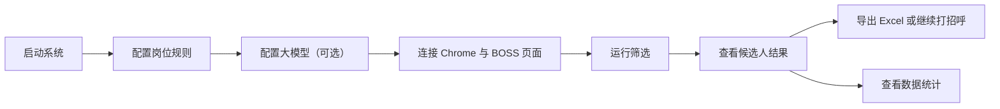
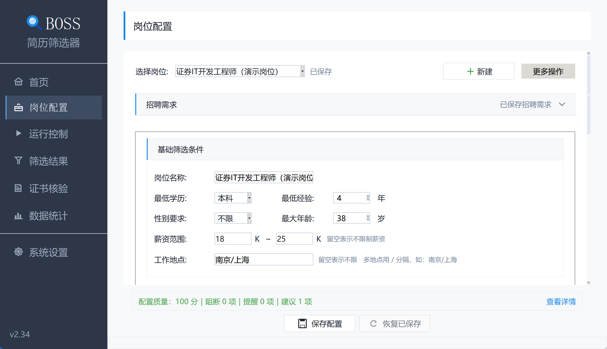
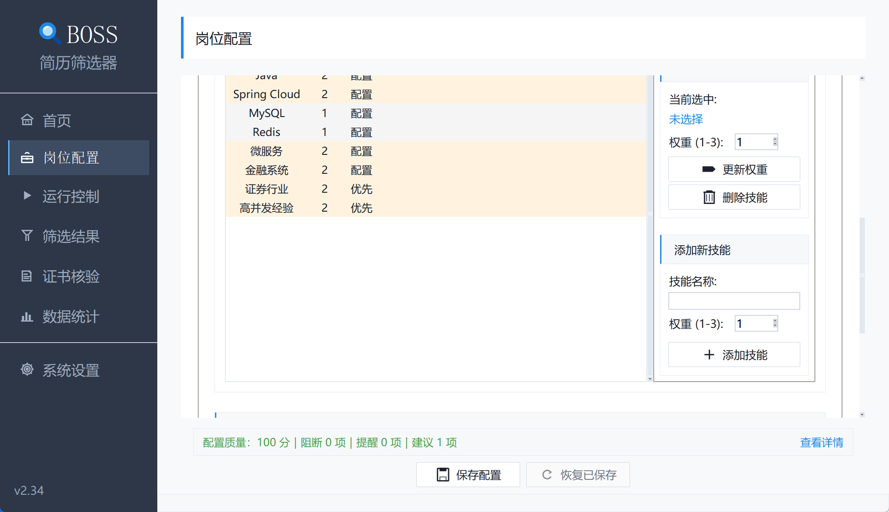
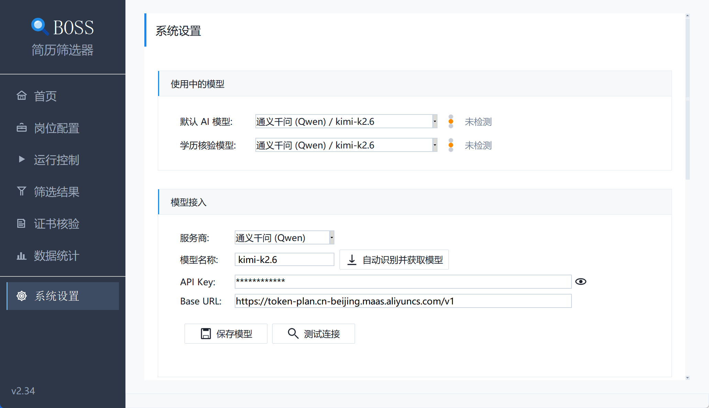
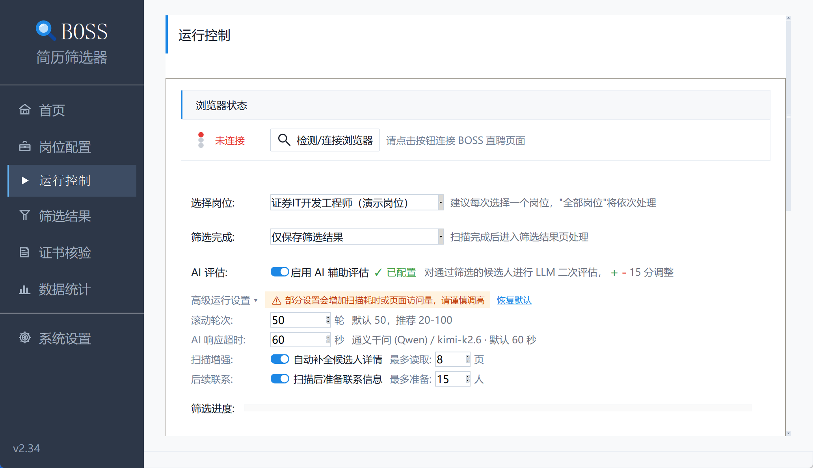
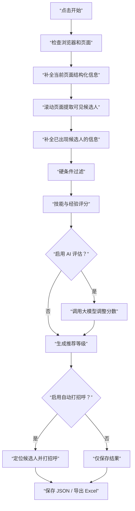
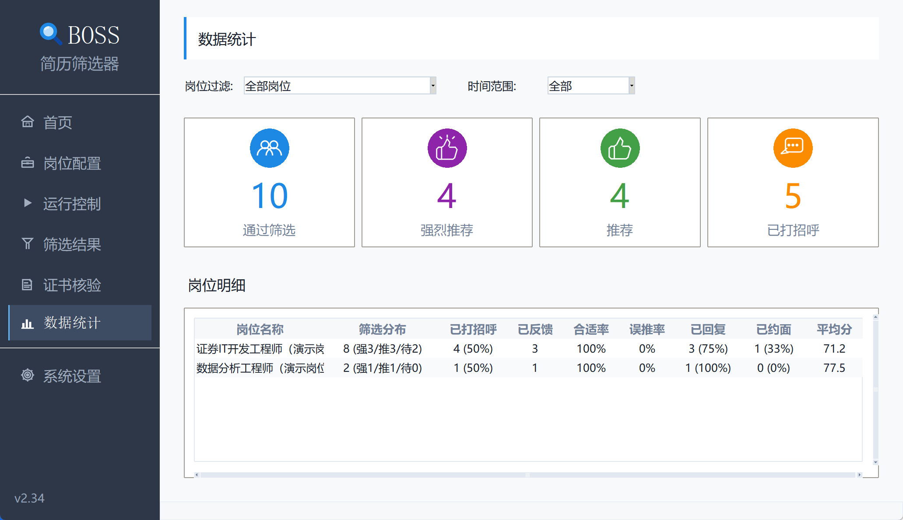
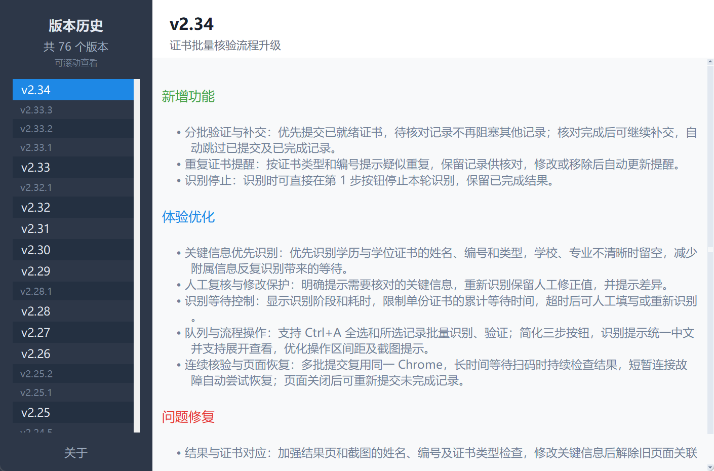
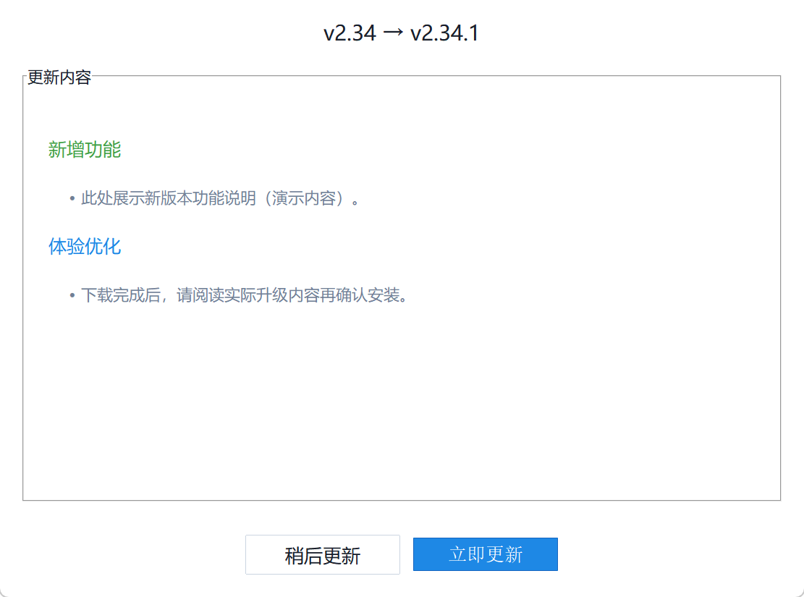

# BOSS 招聘系统操作说明（图文版）

适用版本：当前图形界面版本
适用对象：使用图形界面完成岗位配置、候选人筛选、AI 辅助评估、自动打招呼和结果导出的用户。

本文只覆盖图形界面操作。命令行模式、打包发布、开发维护请查看项目根目录下的 `README.md`、`PACKAGING.md` 和 `AGENTS.md`。

## 一、系统能做什么

BOSS 招聘系统用于把 BOSS 直聘推荐候选人的获取、筛选、评分、打招呼和结果导出串成一个可重复执行的流程。

核心能力：

- 根据招聘需求自动生成岗位规则，并在可用时用 AI 增强解析结果。
- 根据岗位规则过滤候选人：学历、经验、年龄、薪资、工作地点、必要条件。
- 根据技能关键词、优先项和权重计算匹配分。
- 对通过基础筛选的候选人调用大模型做二次评估。
- 导入候选人毕业证书图片或 PDF，识别姓名和证书编号，并辅助打开学信网验证页面。
- 通过页面结构化信息和滚动提取候选人，并只对页面实际出现的候选人补全信息。
- 对符合阈值的候选人自动打招呼，也可多选候选人批量加入打招呼队列、移除或导出。
- 支持候选人黑名单，按 `geek_id` 跨岗位屏蔽，后续扫描、统计和导出自动跳过。
- 支持导入候选人 PDF/Word 简历，基于完整简历做二次 LLM 评估并叠加调整分。
- 保存候选人数据，并导出 Excel。
- 按岗位查看筛选、推荐、打招呼统计和复盘指标。

## 二、主界面总览

启动后进入首页。左侧是固定导航栏，右侧是当前页面内容。

左侧导航含 6 个页面入口，底部另有系统设置入口：

| 导航项 | 用途 |
| --- | --- |
| 首页 | 查看全局候选人统计和快捷入口 |
| 岗位配置 | 新建、修改、导入、导出岗位筛选规则 |
| 运行控制 | 连接浏览器、选择岗位、设置滚动轮次和打招呼策略 |
| 筛选结果 | 查看候选人列表、右键操作、导出 Excel |
| 学历核验 | 导入毕业证书图片或 PDF，识别后填写学信网验证 |
| 数据统计 | 按岗位和时间范围统计筛选结果 |

整体使用顺序如下：

## 三、启动系统

普通用户不要通过命令行启动，直接打开已经安装或打包好的程序。

### Windows

找到 `BOSS_ResumeFilter.exe`，双击打开。

如果系统弹出安全提示，确认文件来源是本项目打包产物后再允许运行。

### macOS

安装后在“应用程序”中打开 BOSS 简历筛选器 `.app`。

如果是从压缩包解压出来的版本，先把 `.app` 拖到“应用程序”，再双击打开。

启动成功后，窗口左下角会显示当前版本号，例如 `v2.19`。

## 四、首次使用流程

第一次使用不要直接点“开始筛选”。正确顺序是：

1. 先进入“岗位配置”，建立至少一个岗位规则。
2. 如果要启用 AI 辅助评估，进入“系统设置”配置大模型。
3. 进入“运行控制”，连接 Chrome 和 BOSS 直聘推荐页面。
4. 选择岗位、滚动轮次和打招呼策略。
5. 点击“开始”运行。
6. 进入“筛选结果”查看候选人。
7. 根据需要导出 Excel 或查看统计。

## 五、配置岗位规则

进入左侧“岗位配置”。

下图以演示岗位为例，展示岗位配置界面的需求解析入口。

### 1. 新建岗位

操作路径：

1. 点击页面上方“新建”。
2. 填写岗位名称。
3. 设置最低学历、最低经验、最大年龄、薪资范围、工作地点。
4. 添加技能关键词和权重。
5. 设置必要条件。
6. 点击“保存配置”。

岗位规则直接决定候选人会不会被淘汰。这里不要随手填，尤其是必要条件和工作地点。

### 2. 用招聘需求自动解析

如果手头有招聘 JD，可以使用“需求文档解析”区域：

1. 把招聘需求粘贴到文本框。
2. 如果不清楚招聘需求该写成什么样，先点击“招聘需求示例”，系统会填入一份需求模板。
3. 按模板结构修改岗位描述、职位要求、薪资、地点和必要条件。
4. 点击“解析招聘需求”。
5. 检查系统自动提取的岗位名称、经验、学历、薪资、地点、技能关键词、优先项和必要条件。
6. 明显不对的字段手工修正。
7. 保存配置。

解析流程会先用本地规则生成基础结果；如果“系统设置”中当前模型和 API Key 可用，会自动启用 AI 增强解析，补充和修正基本信息、技能关键词、优先项和必要条件。AI 暂时不可用、网络超时或模型响应异常时，系统会自动回退到本地规则解析。

AI 增强返回前，如果你已经手工修改了学历、经验、年龄、地点、薪资、技能或必要条件，系统不会再用 AI 结果覆盖这些手工修改。解析结果中的技能列表会显示来源，必要条件支持按简单匹配、OR、AND 三种方式维护；有原文出处时，鼠标悬停在对应列或条件上可以查看来源片段，便于核对系统为什么这样解析。

解析会主动过滤泛化词和噪声词，例如“人工智能”“证券行业”“数据清洗”等不会轻易被当成技术技能；学历、工作年限等基础门槛会归入基本信息，不再混进必要条件；“证券经验优先”“大模型 Agent 经验优先”等优先项会作为额外加分项，不会稀释普通技能关键词匹配分。

v2.15 起，岗位需求解析对硬约束的判断更稳：系统会区分“必须”“至少”“硬性”等强提示词，以及“需要”“要求”“具备”等弱提示词，减少把普通技能描述误判成必要条件的情况；同时支持“应聘条件”“基本要求”“期望你”等更多段落标题。

下图展示解析后的技能、优先项和必要条件检查区域。

解析功能是辅助，不是最终裁决。保存前必须人工检查，尤其是薪资上下限、必要条件、技能关键词权重和优先项是否符合岗位真实要求。

### 3. 字段说明

| 字段 | 说明 |
| --- | --- |
| 岗位名称 | 当前岗位规则名称，也是运行时选择岗位的名称 |
| 最低学历 | 低于该学历的候选人直接淘汰 |
| 最低经验 | 工作年限不足直接淘汰 |
| 最大年龄 | 超过年龄上限直接淘汰；留空表示不限制 |
| 薪资范围 | 候选人期望薪资明显超出预算时淘汰 |
| 工作地点 | 支持多个地点，例如 `南京、上海/杭州` |
| 技能关键词 | 用于评分，不一定直接淘汰 |
| 优先项 | 作为额外加分项参与排序，不参与硬过滤 |
| 必要条件 | 不满足则直接淘汰，适合放“统招本科”等硬要求 |
| 原文出处 | 解析辅助信息，用于人工核对，不保存为正式筛选规则 |

### 4. 技能权重建议

| 权重 | 适用情况 |
| --- | --- |
| 1 | 普通加分项 |
| 2 | 核心技能 |
| 3 | 强核心技能，缺失会显著影响匹配判断 |

不要把所有技能都设成高权重。权重失真后，评分排序会失去意义。

“优先项”不是硬门槛。适合放“证券经验优先”“AI Agent 项目经验优先”“全栈经验优先”这类加分项；不适合放“必须统招本科”“必须 5 年以上经验”这类淘汰条件。

## 六、配置大模型

如果只做规则筛选，可以跳过本节。  
如果要启用“AI 辅助评估”，或希望招聘需求解析时使用 AI 增强结果，必须先进入左侧“系统设置”配置模型。

### 1. 配置步骤

1. 选择服务商，例如通义千问、DeepSeek、Kimi、OpenAI、Anthropic 或自定义。
2. 填写 Base URL。系统会按服务商给出默认地址，自定义服务商需要手工填写。
3. 输入 API Key。
4. 获取或输入模型名称。
5. 点击“保存模型”，将当前配置加入“已保存模型”。
6. 在“使用中的模型”选择默认 AI 模型；需要独立处理学历证书时，可额外选择学历核验模型，或保持“跟随默认 AI 模型”。

### 2. API Key 存储方式

API Key 加密保存在系统钥匙串中，`api_config.json` 不保存明文 Key。

同一服务商可以按 Base URL 区分不同接入方式。例如同一个服务商的标准 API 和 Token Plan 可以分别保存，并分别关联对应的 API Key。

### 3. 已保存模型列表

系统设置页下方显示已保存模型列表，支持：

- **使用中的模型**：分别明确选择默认 AI 模型和学历核验模型；学历核验模型未指定时跟随默认模型。
- **信号灯测试**：点击每个使用中模型右侧的信号灯，测试对应角色实际使用的连接。绿灯代表最近一次成功，红灯代表失败，黄灯代表尚未测试或模型已切换。
- **批量测试连通性**：选中多个已保存模型后右键测试，结果会回写到列表状态列。
- **删除模型**：正在作为默认 AI 模型或学历核验模型使用的记录，需要先在“使用中的模型”中切换后才能删除。

连接测试会区分完整兼容、兼容模式和不兼容；不支持结构化输出的模型会自动改用兼容模式。如果测试失败，先检查 API Key、Base URL 和模型开通状态。

AI 辅助评估的读取超时时间可以在运行控制页调整。系统结合服务商和 Base URL 判断官方 API、官方套餐入口或中转服务；Token Plan、Coding Plan、Step Plan 等官方套餐仍按官方服务处理。官方服务默认 60 秒，中转服务默认 120 秒；如果模型经常慢返回，可以适当调高，但不要把网络、额度或模型不可用问题误当成岗位规则问题。

## 七、连接 BOSS 直聘页面

进入左侧“运行控制”。

### 1. 连接浏览器

操作路径：

1. 点击“检测/连接浏览器”。
2. 系统会尝试连接或启动 Chrome。
3. 登录 BOSS 直聘账号。
4. 打开 BOSS 直聘“推荐牛人”页面。
5. 回到系统确认浏览器状态。

状态判断：

| 状态 | 含义 | 处理方式 |
| --- | --- | --- |
| 未连接 | 系统没有连到 Chrome | 点击检测/连接浏览器 |
| 需导航 | 已连接 Chrome，但不在推荐牛人页面 | 手工打开 BOSS 推荐页面 |
| 已连接 | 已连接到 BOSS 推荐页面 | 可以开始运行 |

### 2. BOSS 页面配合点

网页端需要人工配合的情况：

- 第一次登录账号。
- BOSS 要求短信、扫码或滑块验证。
- 需要切换到指定招聘职位的推荐页面。
- 页面结构变化导致选择器健康检查异常。

系统不会替你绕过验证码。出现验证时，先在浏览器里完成验证，再回到系统继续。

## 八、运行筛选

运行前检查：

- 浏览器状态应为”已连接”。
- BOSS 页面应停留在目标岗位的”推荐牛人”页面。
- “选择岗位”应与 BOSS 页面当前职位一致。
- 如果启用 AI 辅助评估，模型配置应已测试通过。
- 账号需要至少有一个已发布职位；没有已发布职位时，系统会明确提示暂时无法扫描，不会误报为选择器异常。
- 选择器健康检查在连接后自动执行；没有职位或页面没有候选人时会跳过卡片检查，一切正常时不会输出日志。

### 1. 运行参数

| 参数 | 建议 |
| --- | --- |
| 选择岗位 | 单岗位优先；“全部岗位”适合批量处理 |
| 滚动轮次 | 默认 100，推荐 50-200；候选人较少时可适当降低 |
| AI 辅助评估 | 需要模型配置；会增加耗时和 token 成本 |
| 自动打招呼 | 首次测试建议先选“不打招呼（仅筛选）” |

### 2. 打招呼策略

| 策略 | 行为 |
| --- | --- |
| 不打招呼（仅筛选） | 只提取、评分、保存候选人 |
| 仅强烈推荐 | 只给 75 分及以上候选人打招呼 |
| 强烈推荐 + 推荐 | 给 65 分及以上候选人打招呼 |

建议新岗位第一次运行先“仅筛选”，确认规则没有误杀或误放后，再启用自动打招呼。

### 3. 运行过程

点击”开始”后，系统会：

1. 检查浏览器连接、岗位配置和当前页面是否可扫描。
2. 对比当前 BOSS 岗位与所选岗位；不一致时由用户确认是否继续。
3. 先补全当前页面已有的结构化信息，再通过页面滚动建立可见候选人集合，必要时补全已在页面出现的候选人信息。
4. 对候选人执行硬条件过滤和评分。
5. 需要时调用大模型二次评估。
6. 需要自动打招呼时，先展示本次待发送人数并请求确认，再按策略发送消息。
7. 保存候选人数据并导出 Excel。

### 4. 停止运行

点击”停止”后，系统会发出停止信号，并在关键循环中保存当前进度。  
不要直接关闭窗口来中断任务，除非程序已经无响应。

### 5. 本轮结果摘要

运行完成、主动停止或发生异常后，运行控制页的“本轮结果摘要”会保留本次结果：包括完成状态、候选人数量、筛选分布和需要处理的提示。摘要最少显示 3 行、最多 10 行，内容更多时在摘要内部滚动；运行日志只保留过程细节和一行结束状态，避免重复显示整段摘要。达到滚动轮次上限属于本轮正常结束，整体状态显示完成，但摘要会用黄色“未确认扫描到底”提示尚未确认列表底部。账号没有已发布职位、页面不匹配等运行前阻断也会在弹窗中明确说明原因。

### 6. 候选人提取机制

当前使用统一提取流程：页面滚动决定候选人集合，结构化数据只用于补全页面已经出现的候选人。这样可以避免把当前岗位页面之外的数据混入筛选结果。

| 提取阶段 | 作用 | 数据来源 |
| --- | --- | --- |
| 页面信息补全 | 尽量获得当前页面已有的完整字段 | 当前页面可用的结构化信息 |
| 页面滚动 | 确认实际可见候选人并触发继续加载 | 推荐页候选人卡片 |
| 后置补全 | 为已经在页面出现的候选人补齐缺失字段 | 当前岗位可用的候选人信息 |

如果页面刷新前后岗位发生变化，系统会停止扫描并提示切回目标岗位，避免静默抓取错误岗位的候选人。

### 7. 淘汰原因统计

筛选淘汰原因按类别合并统计（经验/学历/年龄/地点/薪资/技术条件），不再逐条列出。数据统计页可以看到各类淘汰原因的分布，便于判断岗位规则是否需要调整。

### 8. 学历筛选改进

当前资格审查分为“明确合格、需人工确认、明确淘汰”三种状态。明确自考、成教、函授等非统招学历时直接淘汰；第一学历明确为大专或专科后取得本科、专升本及本科教育不超过三年时，按统招本科硬条件淘汰；只有本科层级但缺少足够证据时转人工确认。系统会在候选人详情和打招呼确认弹窗中展示原因，需人工确认的候选人不会自动打招呼。

## 九、查看筛选结果

进入左侧“筛选结果”。

### 1. 结果列表

候选人列表默认显示“全部记录”，避免因为筛选范围过窄而误以为候选人数据丢失；已屏蔽候选人默认不显示。重点字段包括：

| 字段 | 含义 |
| --- | --- |
| 姓名 | 候选人名称 |
| 经验 | 工作年限 |
| 薪资 | 期望薪资 |
| 匹配分 | 规则评分 + AI 调整 + 简历评估调整后的最终分 |
| 推荐指数 | 强烈推荐、推荐、待定 |
| AI 评估 | 大模型调整分和评估摘要 |
| 简历评估 | 简历二次评估的调整分和评估摘要 |
| 状态 | 跟进状态（未沟通/已打招呼/已回复/待约面/已约面/不合适/已归档）和人工反馈标记 |
| 风险提示 | 学历形式、工作经验等证据不足时需要人工确认的风险项 |
| 技能匹配 | 命中的技能关键词 |

在候选人行上双击，或选中后点击“查看与复核”，可以打开连续复核工作台。首屏分开显示筛选结论、复核状态和沟通状态，并给出下一步、评分拆解、匹配证据和风险；“完整资料”保留 AI 评估、简历评估、跟进和人工反馈等详细信息。

推荐等级：

| 分数 | 等级 |
| --- | --- |
| 75 分及以上 | 强烈推荐 |
| 65-74 分 | 推荐 |
| 55-64 分 | 待定 |
| 55 分以下 | 初次普通淘汰只进入本轮摘要；曾被推荐、AI 淘汰或已有业务记录时保留供复核 |

结果页可通过“结果范围”切换：

- **推荐候选人**：65 分及以上，且没有人工确认或 AI 评估失败的候选人。发送结果待确认属于沟通状态，不改变原筛选分类，但会阻止重复加入打招呼队列。
- **待复核**：55-64 分候选人，以及不受评分区间限制、存在硬性条件证据不足、需要人工确认或 AI 评估失败的候选人；即使达到推荐分数，只要证据不足仍需先复核。
- **淘汰记录**：值得复核的淘汰候选人，不包含首次普通淘汰。
- **全部记录**：以上范围的汇总视图。

### 2. 常用操作

| 操作 | 说明 |
| --- | --- |
| 刷新结果 | 从 `candidates_all.json` 重新加载 |
| 今日待办 | 每位候选人只进入一个最高优先级任务；“待复核”可按学历形式、求职状态、评分等主要原因展开，其他任务保持单层 |
| 查看与复核 | 从当前选中候选人开始连续处理；未选择时从当前结果第一位开始 |
| 打招呼队列 | 打开队列工作台，查看待发送候选人、发送方式、执行状态和失败原因 |
| 更多操作 | 打开候选人状态体检、导出 Excel 或清空候选人；导出严格使用当前岗位、时间、结果范围和黑名单显示条件 |

Excel 导出包含完整候选人信息，列重排为 5 个区块：身份信息 → 候选人画像 → 评估结果 → 跟进状态 → 原始数据。v2.11 起新增"简历评估"和"简历评估理由"两列；其他辅助列包括：风险提示、是否需人工确认、自动打招呼阻断原因，方便离线审阅和批量处理。

### 3. 右键菜单

单选候选人后右键，可以执行：

- 查看与复核。
- 导入简历或撤销已有的简历评估。
- 在符合联系条件时加入打招呼队列。
- 加入黑名单（记录屏蔽原因，后续扫描按 `geek_id` 跨岗位跳过，统计和默认 Excel 导出不再计入）。
- 更新跟进（未沟通/已打招呼/已回复/待约面/已约面/不合适/已归档 + 备注）。
- 标记反馈（合适/误推/误杀/放弃 + 备注）。
- 移除此人。

按 Ctrl 或 Shift 多选候选人后右键，可以加入打招呼队列、批量 AI 评估、批量移除或导出选中。批量 AI 评估只处理尚未评估且当前可评估的候选人，菜单显示实际人数；所选候选人全部无需重新评估时不显示该操作。跨岗位选择时，系统按岗位分别使用对应的岗位要求。

所有联系动作统一进入打招呼队列。加入队列时，系统会跳过已沟通、需人工确认、分数不足或状态不适合发送的候选人；可直接发送的候选人不依赖当前页面，其他候选人需要浏览器停留在对应岗位的推荐页面。列表页点击后，只有按钮变为“继续沟通”或出现明确成功提示时，系统才会记录为已打招呼；如果页面状态无法确认，系统会提示到 BOSS 沟通列表核实，避免漏记或重复发送。

### 4. 显示已屏蔽候选人

结果页顶部有"显示已屏蔽"开关。默认关闭，只显示未屏蔽的候选人。打开后可以临时查看已加入黑名单的候选人，并在右键菜单中选择"移出黑名单"将其恢复。

### 5. 黑名单与简历二次评估

**黑名单**：将候选人加入黑名单后，系统按 `geek_id` 跨所有岗位屏蔽该候选人。黑名单候选人在后续扫描、数据统计和默认 Excel 导出中被跳过；结果页主动打开“显示已屏蔽”并导出当前可见结果时会保留，并在 Excel 中标明屏蔽状态。清空候选人时，黑名单记录会被保留，不会因为误清而重新刷到同一候选人。

**简历二次评估**：对已有候选人导入 PDF 或 Word 格式的简历文件后，系统会基于完整简历再次调用 LLM 进行评估。存在简历评估结果时，最终分以 `规则评分 + 简历评估调整` 为准，不再叠加一次 AI 调整，避免重复加分或扣分。评估结果和理由会显示在结果列表、复核工作台和 Excel 导出中。如需撤回，可在右键菜单中选择撤回简历评估。

## 十、学历核验

进入左侧“学历核验”。

学历核验用于处理候选人毕业证书图片或 PDF。系统识别证书中的姓名和证书编号，并尝试识别学信网图片验证码、提交查询；自动识别失败时转人工处理，手机扫码和最终核验确认仍由 HR 完成。

### 1. 使用步骤

1. 点击“导入证书”，选择 JPG、JPEG、PNG、BMP、WEBP 图片或 PDF 文件。
2. 检查左侧证书预览，必要时点击“顺转 90°”调整方向。
3. 点击“识别证书”，等待系统识别姓名和证书编号。
4. 核对识别结果；如果字段不准确，直接在输入框中修改。
5. 点击“打开学信网验证”；系统自动填写字段并尝试识别验证码，失败时人工输入或点击“重新识别验证码”，查询提交后由 HR 完成手机扫码。
6. 验证完成后，根据实际结果回填候选人的跟进状态或备注。

### 2. 模型配置

学历核验需要支持图片输入的模型。系统设置页的已保存模型列表中，可以右键将某个模型设为“学历核验模型”。设置后：

- 学历核验使用指定模型。
- AI 简历评估和招聘需求解析继续使用全局模型。
- 删除该模型时，学历核验专用配置会自动清除并回退到全局模型。

如果未指定学历核验模型，系统会使用当前全局模型。全局模型不支持图片输入时，识别可能失败，建议单独指定一个视觉模型。

### 3. 注意事项

- 识别结果只是填写辅助，不等于学历真实性结论。
- 图片验证码会先尝试自动识别，失败时需要人工输入；手机扫码和最终结果确认必须人工完成。
- 导入证书前应取得候选人授权。
- 如果浏览器端口被占用，系统会使用自动端口启动临时浏览器页面，避免默认端口超时。
- 可以批量导入、识别和打开验证；系统为每位候选人创建独立标签页，但 HR 仍需逐项核对姓名、证书编号和最终查询结果，避免候选人信息错配。

## 十一、查看数据统计

进入左侧“数据统计”。

### 1. 统计范围

可以按两个维度过滤：

| 过滤项 | 说明 |
| --- | --- |
| 岗位过滤 | 查看全部岗位或单个岗位 |
| 时间范围 | 今天、本周、全部 |

### 2. 指标含义

| 指标 | 含义 |
| --- | --- |
| 通过筛选人数 | 分数不低于 55 的候选人数 |
| 强烈推荐 | 75 分及以上 |
| 推荐 | 65-74 分 |
| 待定 | 55-64 分 |
| 已打招呼 | 已发送沟通消息的候选人数 |
| 已反馈 | 已标记有效人工反馈（合适/误推/误杀/放弃）的候选人数 |
| 合适率 | 合适人数 / 已反馈人数 |
| 误推率 | 误推人数 / 已反馈人数 |
| 已回复 | 跟进状态为已回复、待约面或已约面的候选人数 |
| 回复率 | 已回复人数 / 已打招呼及后续跟进状态人数 |
| 已约面 | 跟进状态为已约面的候选人数 |
| 约面率 | 已约面人数 / 已回复及后续跟进状态人数 |
| 优质率 | 强烈推荐和推荐在候选人中的占比 |
| 打招呼率 | 已打招呼候选人的占比 |
| 平均分 | 当前统计范围内候选人的平均匹配分 |

数据统计适合看岗位规则质量和跟进转化。如果误推率高，优先检查关键词、优先项和必要条件；如果合适率高但回复率低，优先检查打招呼话术或岗位吸引力。淘汰原因分布可以帮助判断哪类硬条件过于严格或过于宽松。

## 十二、数据文件

常见数据文件：

| 文件 | 用途 |
| --- | --- |
| `job_config.json` | 岗位规则配置 |
| `api_config.json` | 大模型配置，不含明文 API Key |
| `candidates_all.json` | 候选人累积数据 |
| `candidates_all.xlsx` | Excel 导出结果 |
| `selectors.json` | BOSS 页面选择器配置 |

候选人数据按 `(geek_id, job_name)` 去重。相同候选人在不同岗位下会保留为不同记录。

## 十三、版本与自动更新

### 1. 查看当前版本

当前版本显示在窗口左下角，例如 `v2.19`。

点击左下角版本号，可以打开版本历史或更新日志，查看当前版本新增了什么、优化什么、修复了什么。

### 2. 自动更新检查

系统启动后会延迟 12 秒检查是否有新版本，避开 GUI 初始化和程序释放窗口。检查逻辑是后台执行的，不影响正常操作。

更新来源：

| 更新源 | 用途 |
| --- | --- |
| Gitee | 国内优先更新源，通常更快 |
| GitHub | 备用更新源，用于复核和兜底 |

发现新版本后，系统会弹出更新提示。用户可以选择立即更新，也可以稍后再说。更新采用自适应冷却策略：发现新版本 24 小时后再次检查，无更新 4 小时后检查，失败 15 分钟指数退避。

### 3. Windows 更新方式

Windows 版更新流程：

1. 系统下载新版 `.exe`。
2. 校验文件大小和 SHA256。
3. 关闭旧程序。
4. 替换为新版程序。
5. 自动重新启动。

如果更新后没有自动启动，手工双击 `BOSS_ResumeFilter.exe` 即可。

### 4. macOS 更新方式

macOS `.app` 版本会下载新版压缩包，替换应用后重新打开。

如果系统提示权限或安全限制，按 macOS 安全提示处理；不要把 `.app` 放在临时下载目录长期运行，建议放到“应用程序”。

### 5. 更新失败时怎么处理

按这个顺序处理：

1. 关闭当前程序，重新打开一次，看是否继续提示更新。
2. 检查网络是否能访问 Gitee 或 GitHub。
3. 如果下载失败，稍后再试，系统会自动退避重试。
4. 如果校验失败，不要手工改文件，重新触发下载。
5. 如果自动更新始终失败，下载最新安装包或可执行文件后手工替换。
6. 如果启动后提示"上次更新未完成"，按弹窗指引手动重试。

自动更新只更新程序本体，不应该删除你的岗位配置、候选人数据和 API Key。Windows 更新成功后会保留 .old 文件，便于新版本异常时快速恢复。

## 十四、常见问题处理

### 1. 点击开始后提示未连接

处理顺序：

1. 回到”运行控制”。
2. 点击”检测/连接浏览器”。
3. 确认 Chrome 已启动。
4. 确认 Chrome 打开的是 BOSS 推荐牛人页面。
5. 再点击”开始”。

系统启动后不再等待 3 秒，点击”开始”会立即执行检查。

### 2. 浏览器已连接，但提示需要导航

原因是系统连到了 Chrome，但当前页面不是 BOSS 推荐牛人页面。  
在 Chrome 中打开目标岗位的推荐牛人页面，再回到系统。

### 3. BOSS 弹出验证码

系统会暂停等待。处理顺序：

1. 在浏览器中完成验证码。
2. 回到系统提示框。
3. 选择继续等待或继续运行。

如果浏览器里没有看到验证码，可能是误报，可以跳过等待继续运行。

### 4. AI 评估失败

优先检查：

1. API Key 是否保存。
2. Base URL 是否正确。
3. 模型名称是否真实可用。
4. 该模型是否在服务商后台开通。
5. 额度是否耗尽。

不要先改岗位规则。AI 失败和规则筛选是两条链路。

### 5. 候选人很少或质量很差

按这个顺序排查：

1. BOSS 当前职位是否选对。
2. 岗位工作地点是否过窄。
3. 必要条件是否过硬。
4. 技能关键词是否过少或过偏。
5. 滚动轮次是否太低。
6. BOSS 推荐池本身是否已经没有更多候选人。
7. 查看数据统计页的淘汰原因分布，判断哪类硬条件过于严格。

### 6. Excel 没有更新

进入“筛选结果”，在“更多操作”中点击“导出 Excel”。导出使用当前表格的岗位、时间范围、结果范围和黑名单显示条件。
如果仍没有变化，先点击”刷新结果”，确认 `candidates_all.json` 中确实有新候选人。

### 7. 运行页职位被重置

系统会核对刷新前后的岗位标识；发现岗位变化时停止扫描并提示切回目标岗位。如果仍出现职位重置，检查是否在运行过程中手动切换了 BOSS 页面的职位。

### 8. 学历核验识别失败

按这个顺序排查：

1. 证书图片是否清晰、方向是否正确。
2. 当前学历核验模型是否支持图片输入。
3. API Key、Base URL 和模型名称是否测试通过。
4. 如果全局模型不支持视觉能力，到系统设置页右键指定学历核验专用模型。
5. PDF 识别失败时，尝试导出为清晰图片后重新导入。

识别失败不要直接认定证书有问题。先确认图片质量和模型能力。

## 十五、推荐操作习惯

第一次跑新岗位：

1. 先只配置规则。
2. 打招呼策略选“不打招呼（仅筛选）”。
3. 滚动轮次设为 50-200。
4. 看结果里的误杀、误放。
5. 调整岗位规则。
6. 再开启“仅强烈推荐”打招呼。

日常跑成熟岗位：

1. 检查浏览器连接。
2. 确认 BOSS 当前职位。
3. 运行筛选。
4. 先处理“今日待办”和“待复核”。
5. 需要离线报表时，再按当前结果范围导出 Excel。
6. 查看数据统计，判断规则是否需要微调。

## 十六、快速检查清单

运行前：

- 岗位规则已保存。
- BOSS 网页端已登录。
- Chrome 已连接。
- 当前页面是目标岗位的推荐牛人页面。
- 系统里的“选择岗位”和 BOSS 页面职位一致。
- AI 评估需要的模型已测试通过。
- 第一次跑新岗位时未直接启用大范围自动打招呼。

运行后：

- 筛选结果页已刷新。
- Excel 已导出。
- 数据统计已查看。
- 异常候选人已通过详情或 JSON 核对。
- 必要时备份 `candidates_all.json`。
